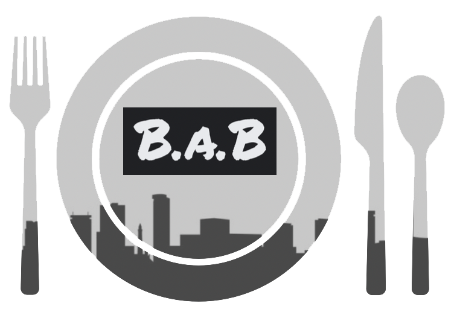

# Birmingham Association Banquets

  

## Description

Birmingham Association Banquets - we are a group of Birmingham based food lovers/web developers. Combining our passions to create a website that helps you find great restaurants in the Birmingham area and beyond!

The application allows a user to search for a city, town or postcode and uses server-side APIs to find data relating to restaurants in that location.

Local restaurants are displayed when a user submits their search. The user is provided with a name, photograph, description, contact information and website for each restaurant.

Each restaurant is also marked on an interactive map allowing a user to clearly see each location. The user is also able to click on the restaurant marker and view more details about that restaurant.

A user can choose to narrow their search by selecting from a range of cuisines - selecting a particular cuisine will mean only restaurants matching the criteria are displayed to the webpage. A user a sort their search by distance or by rating.

The users recent searches are saved to local storage and displayed on the webpage - the user can quickly search a location again by clicking that location in their search history.

If a user enters an invalid input they are presented with a modal explaining their error.

**Technology stack:**

- HTML, CSS, and JavaScript
- jQuery
- Bulma CSS Framework
- Travel Advisor API
- Openlayers 6 Library
- Here Geocoding API
- Deployed to GitHub Pages

**You can register for a Travel Advisor API key here:**
https://rapidapi.com/apidojo/api/travel-advisor

## Animated Screenshot

## Link to deployment

https://oli-drew.github.io/bab-group-project-by-slackware/
